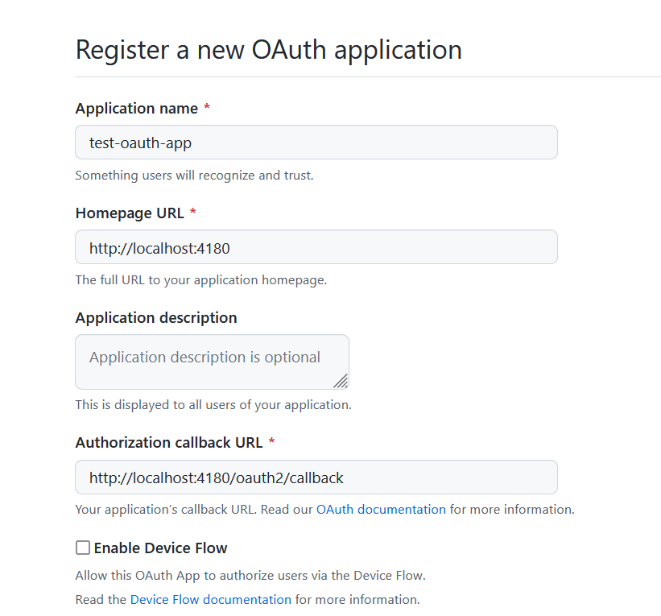

# OAuth2-proxy Shiny Example

This is an example repository for adding constrained authentication to a Shiny App using [OAuth2-proxy](https://oauth2-proxy.github.io/oauth2-proxy/).

It uses GitHub as the OAuth2 provider and uses an email whitelist to determine authorised accounts. 
This example borrows heavily from [Hamel Husain's OAuth2-proxy tutorial](https://github.com/hamelsmu/oauth-tutorial).

## To run locally

To run locally you will need a GitHub account and Docker installed.

1. [Create an OAuth App](https://github.com/settings/applications/new) with GitHub. From this you will get a client ID and be able to create a client secret that you can add to `client_secret` and `client_id` sections of [`oauth2-proxy.cfg`](./oauth2-proxy.cfg).


2. Create an email whitelist as [`emails.txt`](./emails.txt), try this with your email account linked to your GitHub account

3. Create a cookie and add it to the `cookie_secret` parameter in the [`oauth2-proxy.cfg`](./oauth2-proxy.cfg) configuration file.

4. Build a local copy of the Shiny app container
    ```bash
    docker build . -t test-shiny:latest
    ```

5. Run `docker-compose up` in the repository to start the services (this will pull down the oauth2-proxy Docker container the first time you run it)